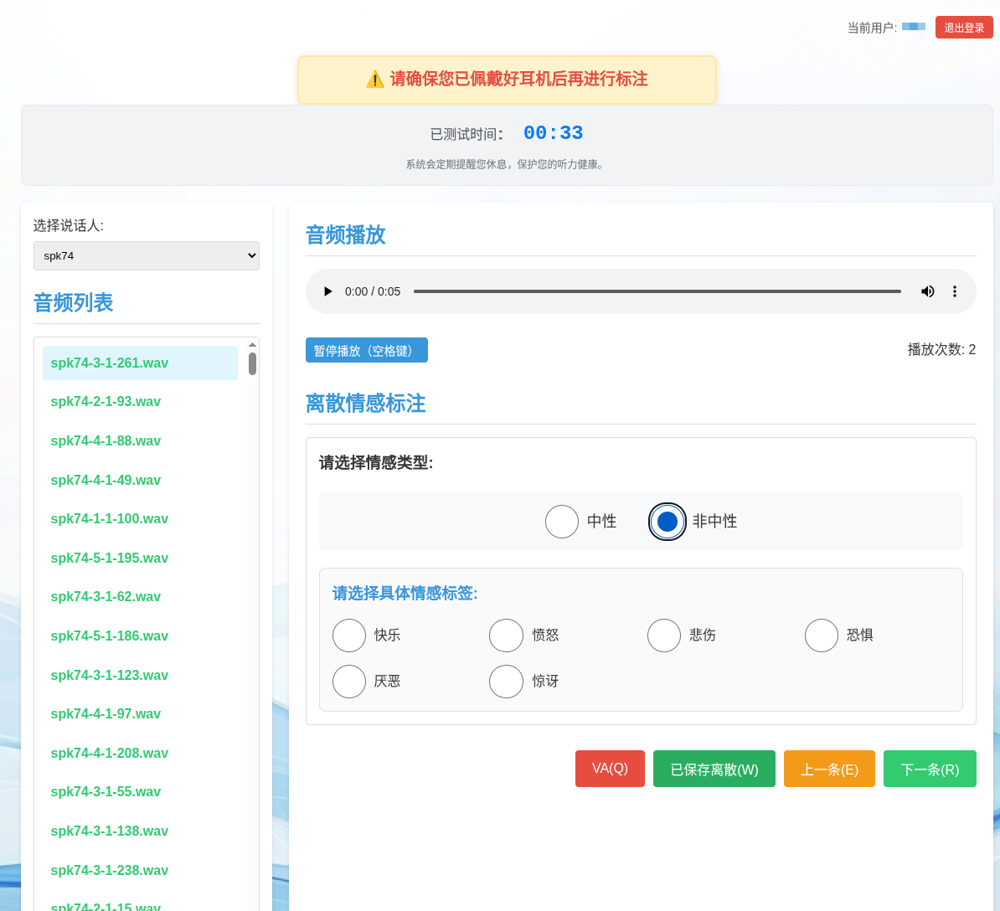
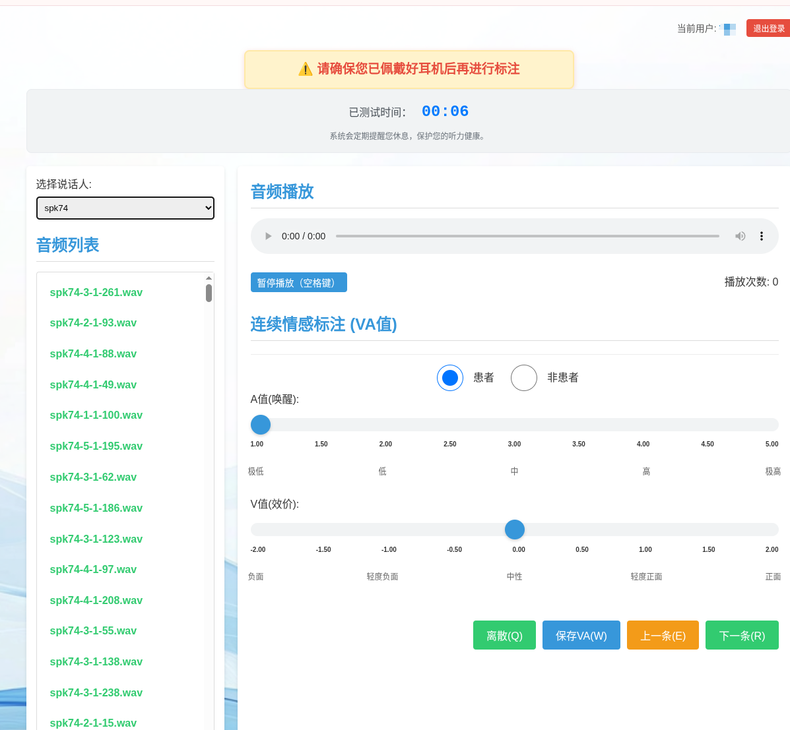

# CCSEMO Dataset and Annotation Tool

## Project Overview

This project is a web-based system for Chinese counseling speech emotion annotation, display, testing, and management. It is designed to support the construction of speech emotion recognition datasets, especially for natural conversational speech collected from psychological counseling scenarios.

The project is inspired by the standardized annotation framework described in the CCSEMO paper. CCSEMO is a Chinese counseling speech emotion dataset collected from real-world counseling conversations. Compared with acted emotional speech datasets, counseling speech contains more subtle, natural, and dynamic emotional expressions, making it more suitable for studying speech emotion recognition in realistic conversational settings.

The system supports emotion annotation for speech segments, including discrete emotion labels, valence, and arousal.

## Features

### Real Conversational Speech Annotation

The system is designed for natural Chinese counseling speech. It can be used to annotate real conversational audio segments where emotions are often subtle, continuous, and context-dependent.

### Multi-Dimensional Emotion Annotation

The system supports both categorical and dimensional emotion annotation:

- Discrete emotion labels
- Valence
- Arousal

Supported discrete emotions may include:

- neutral
- happy
- sad
- angry
- fearful
- surprised
- disgust

### 5-Point and 9-Point Scales

The project provides pages for both 5-point and 9-point annotation scales. The 9-point scale is suitable for fine-grained emotion annotation, especially when more detailed valence and arousal ratings are required.

### Annotation Quality Control

The system includes testing, consistency evaluation, volume testing, and administrator management features. These functions help improve annotation quality and reduce subjective variation among annotators.

### Data Management and Analysis

The system provides tools for annotation management, standard answer management, group assignment, data analysis, export, and progress tracking.

## Related Experimental Repositories

We provide two baseline code archives for the emotion recognition experiments reported with CCSEMO:

- **Continuous Emotion Recognition**: `CCSEMO_Continuous_Emotion_Recognition_Baseline.zip` - baseline experiments for continuous emotion recognition, including Valence-Arousal prediction with pretrained speech models and pitch feature fusion.
- **Discrete Emotion Recognition**: `CCSEMO_Discrete_Emotion_Recognition_Baseline.zip` - baseline experiments for discrete emotion classification, including 4-class and 7-class speech emotion recognition.

## Use Cases

This project can be used for:

- Building Chinese speech emotion recognition datasets
- Annotating real-world counseling speech
- Training and evaluating speech emotion recognition models
- Conducting annotator training and qualification tests
- Performing consistency testing among annotators
- Studying affective computing in psychological counseling scenarios

## Annotation Labels

The system supports the following annotation targets:

```text
Discrete Emotions
├── neutral
├── happy
├── sad
├── angry
├── fearful
├── surprised
└── disgust

Dimensional Emotions
├── Valence
└── Arousal
```

## Project Structure

```text
CCSEMO_dataset_and_annotation_tool/
├── app.py                    # Flask application entry
├── start_server.py           # Server startup script
├── start_server_local.py     # Local reverse-proxy startup script
├── config.py                 # Project configuration
├── routes/                   # Page routes and API routes
├── services/                 # Business logic services
├── models/                   # Data models
├── templates/                # HTML templates
├── static/                   # CSS, JavaScript, and image assets
├── scripts/                  # Data import and database management scripts
├── utils/                    # Utility functions
├── docs/                     # Documentation files
├── database/                 # Database-related files
└── data/                     # Local audio data directory
```

## Usage

### 1. Install Dependencies

Using `uv` is recommended:

```bash
uv sync
```

### 2. Configure Environment Variables

Create a `.env` file before running the application:

```env
FLASK_ENV=development
FLASK_DEBUG=False
SECRET_KEY=your-secret-key
```

Do not commit `.env` to a public repository.

### 3. Start the Server

Recommended startup command:

```bash
uv run python start_server.py
```

For local reverse-proxy mode:

```bash
./run_local.sh
```

### 4. Open the Web App

After startup, visit:

```text
http://server-address:5001
```

Common pages:

```text
/              Main annotation page
/5point        5-point scale annotation page
/9point        9-point scale annotation page
/test          Annotation test page
/volume-test   Volume test page
```

## Notes

- This project is intended for research, education, and dataset annotation experiments.
- Audio data, database files, user annotation data, and `.env` files should not be committed to public repositories.
- Counseling speech data may contain sensitive personal information. Make sure all data is properly authorized, anonymized, and ethically handled before use.
- Emotion annotation is inherently subjective. Multiple annotators, standard-answer tests, consistency checks, and voting mechanisms are recommended.
- Real conversational emotions are often more subtle than acted emotions, so model performance may be lower than on traditional acted speech datasets.

## Dataset Access and License Agreement

The CCSEMO dataset is released for research purposes only. Researchers who request access to the dataset should complete and sign the CCSEMO non-exclusive license agreement before receiving the data.

The license agreement template is provided as:

```text
License Agreement_CCSEMO_SIAT.docx
```

Completed license agreements and dataset access requests can be sent to:

```text
huanraozhineng2@siat.ac.cn
```

The signed agreement should include the applicant's name, title, institution, address, email, handwritten signature, and date. The dataset must not be used for commercial purposes, redistributed, published, copied, sublicensed, or made available to third parties without prior written consent from AIMSL, SIAT.

## Associated Publication

This repository accompanies the work described in the following paper:

**CCSEMO: A Chinese Counseling Speech Emotion Dataset annotated via a unified standardized annotation framework**

The paper presents the CCSEMO dataset, a standardized annotation framework for Chinese counseling speech emotion data, and the balanced CCSEMO-mini subset. This web system is part of the supporting work for that study, providing practical tooling for speech segment annotation, annotator testing, consistency evaluation, data management, and quality control.

## Interface Preview

The annotation system provides two task-specific interfaces. The discrete emotion page supports categorical emotion labeling for each speech segment, while the continuous emotion page supports valence-arousal annotation with slider-based controls.

### Discrete Emotion Annotation Interface



### Continuous Emotion Annotation Interface


